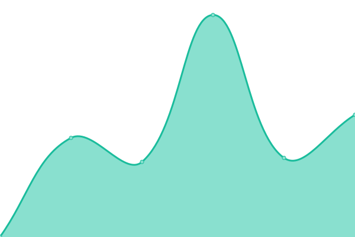

# [📈 Live Status](https://Aissi17.github.io/upptime-fentech): <!--live status--> **🟩 All systems operational**

This repository contains the open-source uptime monitor and status page for [Seif el Islam ](https://Aissi17.github.io/upptime-fentech), powered by [Upptime](https://github.com/upptime/upptime).

<!--start: status pages-->
<!-- This summary is generated by Upptime (https://github.com/upptime/upptime) -->
<!-- Do not edit this manually, your changes will be overwritten -->
<!-- prettier-ignore -->
| URL | Status | History | Response Time | Uptime |
| --- | ------ | ------- | ------------- | ------ |
|  [Fentech Carrefour](https://carrefour.prod.clairvoyant.fentech.ai) | 🟩 Up | [fentech-carrefour.yml](https://github.com/Aissi17/upptime-fentech/commits/HEAD/history/fentech-carrefour.yml) | 

 807ms
     
 | 

<a href="https://Aissi17.github.io/upptime-fentech/history/fentech-carrefour">100.00%</a>
    

<!--end: status pages-->

[**Visit our status website →**](https:fentech.ai)

## 📄 License

- Powered by: [Upptime](https://github.com/upptime/upptime)
- Code: [MIT](./LICENSE) © [FENTECH](https://fentech.ai)
- Data in the `./history` directory: [Open Database License](https://opendatacommons.org/licenses/odbl/1-0/)
